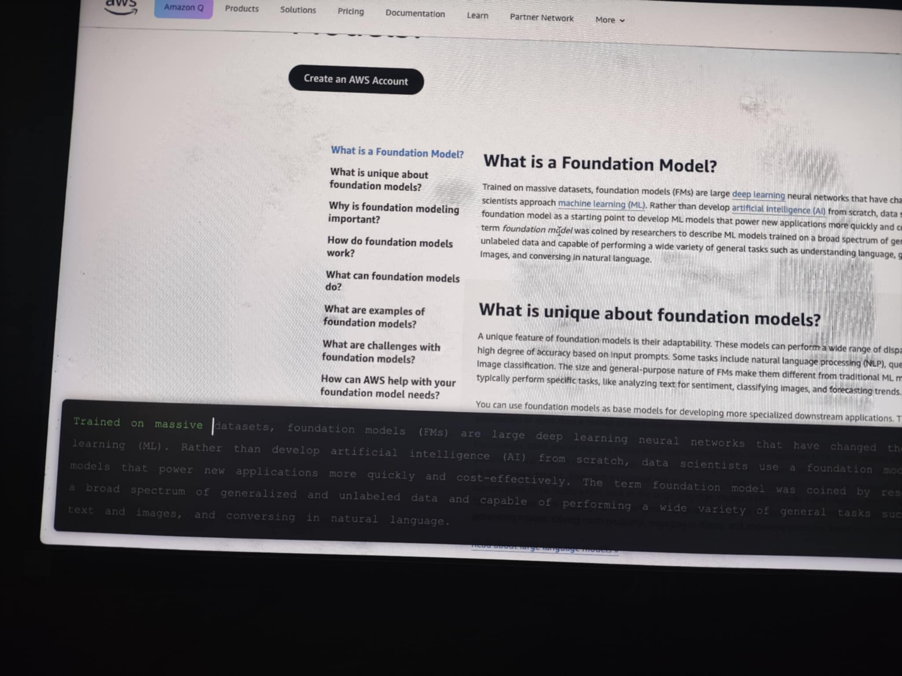
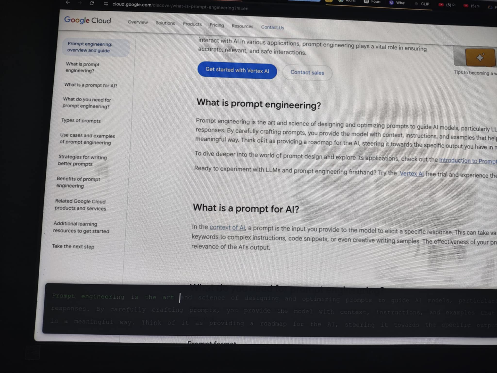

# Type Along

Type Along is a simple yet powerful Chrome extension designed to supercharge your learning. Just hover over any paragraph on a webpage, and a popup will appear—allowing you to read and type along at the same time. It’s an active way to absorb information, improve retention, and sharpen focus.

Built on the idea that "Reading is like breathing in, writing is like breathing out," Type Along helps transform passive reading into an engaging, hands-on experience.

## Not publish yet

How to load the extension in chrome?
1. Go to `chrome://extensions`.
2. Enable `Developer Mode`.
3. Click `Load unpacked`.
4. Select your `type-along-extension` folder.

## Examples

